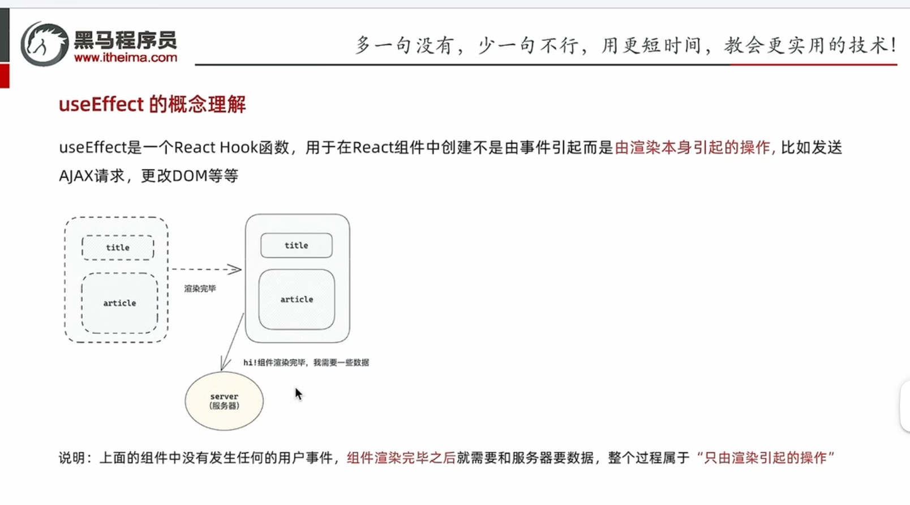
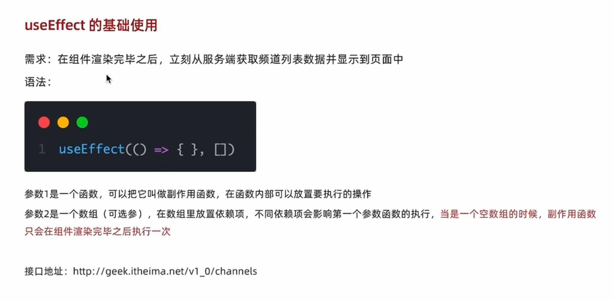

# React 条件渲染笔记

## 1. 使用 if 语句和变量
```jsx
function App() {
  const flag = true;
  let content = '';
  
  if (flag) {
    content = <div>Flag is true</div>;
  } else {
    content = <div>Flag is false</div>;
  }

  return (
    <div>{content}</div>
  );
}
```

## 2. 使用 && 运算符（内联条件）
```jsx
function App() {
  const flag = true;
  
  return (
    <div>
      {flag && <span>Only shown if flag is true</span>}
    </div>
  );
}
```

## 3. 使用三元运算符
```jsx
function App() {
  const flag = true;
  
  return (
    <div>
      {flag ? (
        <span>Flag is true</span>
      ) : (
        <span>Flag is false</span>
      )}
    </div>
  );
}
```

## 4. 立即执行函数
```jsx
function App() {
  const flag = true;
  const count = 5;
  
  return (
    <div>
      {(() => {
        if (flag && count > 3) return <span>Complex condition met</span>;
        if (flag) return <span>Only flag is true</span>;
        return <span>Default case</span>;
      })()}
    </div>
  );
}
```

## 5. 使用对象映射（适用于多条件）
```jsx
const CONTENT_TYPES = {
  draft: <DraftContent />,
  published: <PublishedContent />,
  archived: <ArchivedContent />
};

function App() {
  const status = 'published';
  
  return (
    <div>
      {CONTENT_TYPES[status] || <DefaultContent />}
    </div>
  );
}
```

## 6. 组件内部条件渲染
```jsx
function Button({ isLoading, children }) {
  return (
    <button disabled={isLoading}>
      {isLoading ? 'Loading...' : children}
    </button>
  );
}
```

## 7. 使用 null 隐藏组件
```jsx
function App() {
  const shouldShow = false;
  
  return (
    <div>
      {shouldShow ? <UserProfile /> : null}
      {/* 或使用 && 运算符 */}
      {shouldShow && <UserProfile />}
    </div>
  );
}
```

## 使用建议
1. **简单条件**：优先使用 `&&` 运算符
2. **二选一**：使用三元运算符
3. **多条件**：使用变量存储或对象映射
4. **复杂逻辑**：抽取为独立函数或组件

## 注意事项
- `&&` 运算符左侧避免使用数字，可能会意外渲染 `0`
- 条件渲染不影响组件生命周期和重渲染
- 优先考虑代码可读性选择合适的条件渲染方式

# React 列表渲染笔记

## 1. 基础数组渲染
```jsx
function App() {
  const names = ['小昊', '小李', '小花'];
  
  return (
    <ul>
      {names.map(name => (
        <li>{name}</li>
      ))}
    </ul>
  );
}
```

## 2. 对象数组渲染（最常用）
```jsx
function App() {
  const users = [
    { id: 1, name: '小昊', age: 25 },
    { id: 2, name: '小李', age: 24 }
  ];
  
  return (
    <div>
      {users.map(user => (
        <div key={user.id}>
          <h3>{user.name}</h3>
          <p>{user.age}岁</p>
        </div>
      ))}
    </div>
  );
}
```

## 3. 带事件处理
```jsx
function App() {
  const items = ['苹果', '香蕉', '橙子'];
  
  const handleClick = (item) => {
    console.log(`选择了${item}`);
  };
  
  return (
    <ul>
      {items.map((item, index) => (
        <li key={index} onClick={() => handleClick(item)}>
          {item}
        </li>
      ))}
    </ul>
  );
}
```

## 关键注意点
1. **必须提供 `key` 属性**
   - 优先使用唯一ID作为key
   - 只在没有唯一ID时才使用index作为key
2. **使用 `map` 必须在 `{}` 内**
3. **可以在map中直接返回JSX**

# useEffect


让我为您解释 useEffect 的清理函数（cleanup function）机制。

# useEffect 清理函数笔记

## 1. 基本原理
```jsx
useEffect(() => {
  // 副作用代码
  return () => {
    // 清理函数
    // 会在组件卸载前或重新执行副作用前调用
  };
}, [dependencies]);
```

## 2. 常见使用场景

### 事件监听器
```jsx
useEffect(() => {
  const handleScroll = () => {
    // 处理滚动
  };
  window.addEventListener('scroll', handleScroll);
  
  return () => {
    // 清理监听器，防止内存泄漏
    window.removeEventListener('scroll', handleScroll);
  };
}, []);
```

### 定时器
```jsx
useEffect(() => {
  const timer = setInterval(() => {
    // 定时执行的代码
  }, 1000);
  
  return () => {
    // 清理定时器，防止内存泄漏
    clearInterval(timer);
  };
}, []);
```

### WebSocket 连接
```jsx
useEffect(() => {
  const ws = new WebSocket('ws://example.com');
  ws.onmessage = handleMessage;
  
  return () => {
    // 关闭连接
    ws.close();
  };
}, []);
```

## 3. 何时需要清理函数
- 事件监听器
- 定时器
- WebSocket/长连接
- 订阅
- 异步操作的取消
- DOM 操作的还原

## 4. 何时可以不需要清理函数
- 纯数据获取（fetch）
- 一次性的 DOM 更新
- localStorage 操作
- 无持续性副作用的操作

记住：如果副作用会持续存在或占用资源，通常需要清理函数；如果是一次性的操作，可以不需要清理函数。